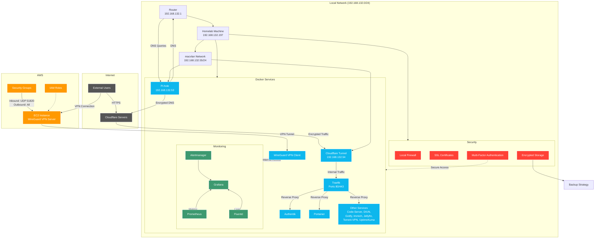

```mermaid
graph TB
    subgraph Internet
        ExtUsers[External Users]
        CFServers[Cloudflare Servers]
    end

    subgraph AWS
        EC2[EC2 Instance<br>WireGuard VPN Server]
        SG[Security Groups]
        IAM[IAM Roles]
    end

    subgraph LocalNetwork["Local Network (192.168.132.0/24)"]
        Router[Router<br>192.168.132.1]
        HomelabMachine[Homelab Machine<br>192.168.132.197]
        
        subgraph DockerServices["Docker Services"]
            CFTunnel[Cloudflare Tunnel<br>192.168.132.54]
            Pihole[Pi-hole<br>192.168.132.53]
            Traefik[Traefik<br>Ports 80/443]
            Authentik[Authentik]
            Portainer[Portainer]
            OtherServices[Other Services<br>Code-Server, DIUN,<br>Gotify, Immich, Jellyfin,<br>Torrent-VPN, UptimeKuma]
            VPNClient[WireGuard VPN Client]
            
            subgraph Monitoring
                Grafana[Grafana]
                Prometheus[Prometheus]
                Fluentd[Fluentd]
                Alertmanager[Alertmanager]
            end
        end
        
        subgraph Security
            LocalFirewall[Local Firewall]
            SSL[SSL Certificates]
            EncryptedStorage[Encrypted Storage]
            MFA[Multi-Factor Authentication]
        end

        MacVLAN["macvlan Network<br>192.168.132.55/24"]
    end
    
    ExtUsers -->|VPN Connection| EC2
    EC2 -->|VPN Tunnel| VPNClient
    SG -->|Inbound: UDP 51820<br>Outbound: All| EC2
    IAM -.-> EC2
    
    ExtUsers -->|HTTPS| CFServers
    CFServers -->|Encrypted Traffic| CFTunnel
    CFTunnel -->|Internal Traffic| Traefik
    
    Router --> HomelabMachine
    HomelabMachine --> DockerServices
    HomelabMachine --> Security
    HomelabMachine --> MacVLAN
    
    Traefik -->|Reverse Proxy| OtherServices
    Traefik -->|Reverse Proxy| Authentik
    Traefik -->|Reverse Proxy| Portainer
    
    Pihole -->|DNS| Router
    Router -->|DNS Queries| Pihole
    Pihole -->|Encrypted DNS| CFServers
    
    MacVLAN --> Pihole
    MacVLAN --> CFTunnel
    
    DockerServices -->|Metrics| Prometheus
    DockerServices -->|Logs| Fluentd
    Prometheus --> Grafana
    Fluentd --> Grafana
    Alertmanager --> Grafana
    
    MFA -.->|Secure Access| DockerServices
    
    VPNClient -->|Internal Access| DockerServices

    BackupStrategy[Backup Strategy]
    EncryptedStorage --> BackupStrategy
    
    classDef aws fill:#FF9900,stroke:#ffffff,stroke-width:2px,color:#ffffff;
    classDef docker fill:#0db7ed,stroke:#ffffff,stroke-width:2px,color:#ffffff;
    classDef security fill:#ff4136,stroke:#ffffff,stroke-width:2px,color:#ffffff;
    classDef monitoring fill:#3D9970,stroke:#ffffff,stroke-width:2px,color:#ffffff;
    classDef internet fill:#555555,stroke:#ffffff,stroke-width:2px,color:#ffffff;
    
    class EC2,SG,IAM aws;
    class CFTunnel,Pihole,Traefik,Authentik,Portainer,OtherServices,VPNClient docker;
    class LocalFirewall,SSL,EncryptedStorage,MFA security;
    class Grafana,Prometheus,Fluentd,Alertmanager monitoring;
    class ExtUsers,CFServers internet;
```